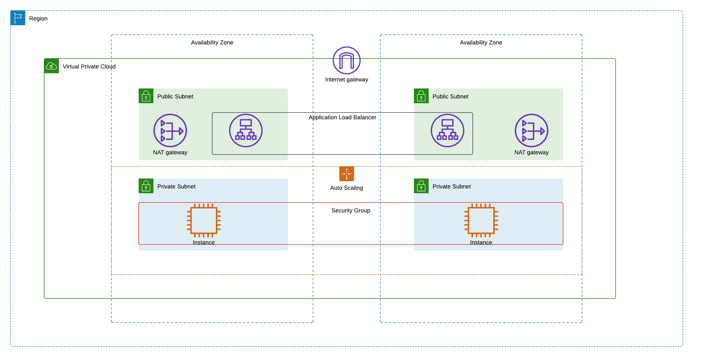

# Automating AWS Public Private Subnet Architecture

## Overview

This repository contains Shell Scripts Codes to automate the deployment of aws public private subnet architecture using AWS CLI

## Architecture

The infrastructure contains following key components:

- **VPC Configuration:**

  - Region: ap-southeast-2
  - Dual Availability Zones (ap-southeast-2a, ap-southeast-2b)
  - Public and Private Subnets
  - NAT Gateways for private subnet connectivity
  - Internet gateway for public access

- **Network Configuration:**

  - VPC CIDR: 10.0.0.0/16
  - Public Subnet 2a: 10.0.1.0/24
  - Private Subnet 2a: 10.0.2.0/24
  - Public Subnet 2b: 10.0.3.0/24
  - Private Subnet 2b: 10.0.4.0/24

## Prerequisites

- AWS Account with proper permissions
- Bash Installed
- AWS CLI configured with credentials
- Git to clone

## Project Structure:

- **`global_variables.sh`**: Contains the global variables
- **`global_functions.sh`**: Contains the global functions
- **`start_script.sh`**: Starts the script and contains all the other run able scripts.
- **`vpc.sh`**: Contains the script to create vpc and enables dns hostname and dns support.
- **`subnets.sh`**: Creates the subnets and enables auto-assign public ip address when instances are launched
- **`igw.sh`**: Creates the internet gateway and attaches it to the vpc
- **`nat_gateways.sh`**: Creates the nate gateways on public subnets
- **`route_tables.sh`**: Creates the route tables, create routes and associates the subnets with route tables
- **`security_group.sh`**: Creates security group and associates inbound rules
- **`key_pair.sh`**: Creates fresh keypair and stores it on your local machine
- **`launch_template.sh`**: Creates the launch template to create instances for auto scaling
- **`auto_scaling_group.sh`**: Creates an auto scaling group
- **`target_group.sh`**: Creates a target group for lb load_balancer.sh
- **`load_balancer.sh`**: Creates a load balancer

## License

This project is based under [The MIT License](https://opensource.org/license/mit/).
